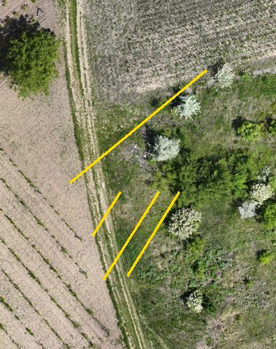

# VinePlan · QA report

Generated 2026-09-27 02:28 · commit `899c527` · annotations `out/marcaj_global.xml` (md5 807514f04e) · Apple M4 Pro, 24 GB RAM, 12 cores, Darwin 27.0.0, Python 3.12.1 · 32 s

**36 PASS · 5 WARN · 0 FAIL** out of 41 checks. PASS: meets the threshold. WARN: known limitation or close to the limit, explained below. FAIL: broken.

Integration tests run on the real Sireț3 data (311 tiles, the annotations sent to Marcaj, the official route) and on synthetic tiles built to hit one edge case each. Rerun: `python -m pipeline.qa --perf` (this report) or `VINEPLAN_INTEGRATION=1 python -m unittest tests.test_integration` (the same checks as tests).

| Level | Checks | PASS | WARN | FAIL |
|---|---|---|---|---|
| Boundaries | 8 | 7 | 1 | 0 |
| Look-alikes (shrubs, trees, meadows, tubes) | 6 | 4 | 2 | 0 |
| Edge cases | 13 | 12 | 1 | 0 |
| Rules and consistency | 9 | 9 | 0 | 0 |
| Performance and scalability | 5 | 4 | 1 | 0 |

## Boundaries

| ID | Check | Measured | Threshold | Status |
|---|---|---|---|---|
| B1 | A row cut by a tile edge keeps its row_id and vineyard_id in the next tile | 718 seams: same row_id 99.0%, same vineyard_id 99.4% | ≥ 97 % (WARN ≥ 90 %) | **PASS** |
| B2 | Every vertex lies inside its 2048 × 2048 px tile | 0 of 265,078 vertices outside | 0 | **PASS** |
| B3 | No canopy or row on the black no-data border of edge tiles | 0 of 2,305 objects on 20 tiles with a no-data border | 0 (WARN ≤ 0.2 %) | **PASS** |
| B4 | Row axes stop at the road: share of row length lying on authorised passages | 1,258 m of 45,664 m = 2.8% | ≤ 1 % (WARN ≤ 5 %) | **WARN** |
| B5 | Inter-row areas never overlap canopies | 13.6 m² = 0.10% of the canopy area | ≤ 0.5 % (WARN ≤ 2 %) | **PASS** |
| B6 | Official route: valid, back at START, 0 row crossings, nothing through canopies or forbidden zones | 18.61 km · outside 1.48% · start/end 0.0/0.0 m · 0 row crossings · canopies 0.0 m · forbidden 0.0 m | valid, ≤ 2 % outside, ≤ 5 m, 0 crossings | **PASS** |
| B7 | The route never leaves the study area or the authorised passages | 0.00 m outside | < 1 m | **PASS** |
| B8 | Polygons are valid (no self-intersections) as exported to Marcaj | 0 of 14,672 polygons invalid | ≤ 0.1 % (WARN ≤ 1 %) | **PASS** |

**B1** · Seam = two row ends facing each other across a tile edge, < 1.5 m apart, < 0.5 m sideways.
- V02-R64 (r007_c00) ≠ V02-R65 (r008_c00)
- V02-R65 (r008_c00) ≠ V02-R64 (r008_c00)
- V14-R16 (r019_c01) ≠ V15-R17 (r020_c01)
- V15-R26 (r021_c01) ≠ V17-R25 (r021_c01)
- V15-R32 (r021_c01) ≠ V17-R31 (r022_c01)
- V15-R33 (r021_c01) ≠ V17-R32 (r022_c01)

**B3** · An object counts when its centre (canopy) or most of its axis (row) lies on black pixels.

**B4** · Rules 4.4: rows and inter-rows stop at the edge of the planting, not at the road centre. Part of this is the organisers' passage polygons overlapping planted rows (seen on the orthophoto).
- V19-R01: 65.0 m on a road
- V18-R11: 62.1 m on a road
- V21-R11: 54.1 m on a road
- V19-R01: 47.9 m on a road
- V14-R56: 42.3 m on a road

**B5** · Rules: canopies and inter-row areas never overlap; the inter-row runs from canopy edge to canopy edge.

**B6** · Checked by pipeline.validate against the annotations.

**B8** · Invalid rings are repaired with make_valid in every measurement; Marcaj accepts them.

## Look-alikes (shrubs, trees, meadows, tubes)

| ID | Check | Measured | Threshold | Status |
|---|---|---|---|---|
| C1 | Canopy shape: no shrub or tree crown counted as a vine (compared with the reference tiles) | width p99 0.60 m (reference 0.63 m), 0.00% wider than 1.2 m; 5.6% of 13,454 canopies > 3 m² (reference tiles 2.2%); median 0.50 m² | ≤ 0.5 % wider than 1.2 m; share > 3 m² ≤ 2× the reference (WARN ≤ 3×) | **WARN** |
| C2 | Rows sit on vines, not on striped meadows, tracks or scrub (vegetation on the axis vs between rows) | 1 of 47 blocks mostly on weak rows; 1.0% of all row length weak | 0 blocks > 50 % weak | **WARN** |
| C3 | White vine tubes are not waste: no waste box on a row axis | 0 of 11 waste boxes within 0.4 m of a row axis | 0 | **PASS** |
| C4 | No waste on roofs or inside forbidden zones (village, buildings) | 0 of 11 | 0 | **PASS** |
| C5 | Waste boxes are object-sized (0.1–2.5 m) | 0 of 11 out of range | 0 | **PASS** |
| C6 | Garden rule: every block has at least 3 rows | 0 of 47 blocks with < 3 rows | 0 | **PASS** |

**C1** · Rules 2.2–2.3: a vine is under 1 m wide, a tree crown 2–4 m and round. Touching canopies of older vines are long, narrow blobs, and the reference keeps them whole (tile r006_c004: up to 31 m²), so size alone is not an error.

**C2** · Support = vegetation (ExG > 0.10) on the axis ± 0.15 m ÷ vegetation on the two mid-lines; weak < 1.3. Known limitation of the classical detector on striped meadows and scrub: these blocks are on the Marcaj correction list.
- V37: 59% of 62 m of rows weakly supported

**C3** · Rules 3: white protective tubes and stakes next to young vines belong to the planting.

**C6** · Rules 2.3: a single vine or two rows in a yard is not a vineyard.

## Edge cases

| ID | Check | Measured | Threshold | Status |
|---|---|---|---|---|
| E1 | Black no-data tile → nothing detected | 0 objects | 0 | **PASS** |
| E2 | Uniform grass meadow → no rows | 0 rows, 0 objects | 0 rows | **PASS** |
| E3 | Random noise → no rows | 0 rows, 0 objects | 0 rows | **PASS** |
| E4 | Bare tilled soil → nothing detected | 0 objects | 0 | **PASS** |
| E5 | Orchard (crowns 3 m wide, 5 m apart) → not taken for a vineyard | 0 rows, 0 objects | 0 rows | **PASS** |
| E6 | Striped meadow (continuous 1.3 m green / 1.3 m dry strips) → no rows | 19 rows, 19 canopies | 0 rows | **WARN** |
| E7 | Synthetic vineyard 2.6 m × 1.2 m → every row, the right spacing, one canopy per vine | 19 rows (expected ~20), spacing 2.60 m, 817 canopies | rows ± 2, spacing ± 5 %, ≥ 80 % of the vines | **PASS** |
| E8 | Vineyard rotated 35° → rows found at the right angle | 27 rows, median angle error 0.0° | ± 3° | **PASS** |
| E9 | Edge tile, right half black → rows only on the image, nothing on no-data | 19 rows, 0 objects on the black half | rows > 0, 0 on black | **PASS** |
| E10 | An 8 m planting gap marks that row 'disrupted', the others stay 'regular' | gap row: disrupted; others {'regular': 18} | disrupted; others regular | **PASS** |
| E11 | Marcaj export with folder-prefixed image names is read tile by tile | 12 of 12 tiles recovered | 12 | **PASS** |
| E12 | Missing attributes in an export are reported, not silently accepted | row without row_id: 1, interrow without interrow_cover: 1, vineyard without vineyard_id: 1 | all three reported | **PASS** |
| E13 | CVAT write → read round trip keeps every object and attribute | 5,312 objects on 40 tiles | identical | **PASS** |

**E2** · Green everywhere: no periodic row pattern.

**E5** · Rows 5 m apart are outside the vine spacing band (2.0–3.4 m).

**E6** · Known limitation: continuous strips at a vine-like spacing look like rows to a classical detector. In the real data the YOLO11 canopy veto and the human correction in Marcaj remove them (see C2).

**E10** · Rules 4.3: a visible gap of 5 m or more along the row makes it disrupted; the row is not split.

## Rules and consistency

| ID | Check | Measured | Threshold | Status |
|---|---|---|---|---|
| R1 | Labels and attributes exactly as in the annotation rules (lower case, allowed values, none missing) | no violation | 0 | **PASS** |
| R2 | One polyline per physical row per tile | 0 duplicated row_id in a tile (1,447 row polylines) | 0 (WARN ≤ 1 %) | **PASS** |
| R3 | row_id belongs to its block (V03-R017 lies in V03) and every row_id is used in one block only | 0 row_ids outside their block, 0 in several blocks, 691 rows | 0 | **PASS** |
| R4 | Upload ZIPs: 311 original tiles (byte-identical), each ZIP < 90 MB, labels as in Appendix A | 9 ZIPs, 311 tiles (0 duplicates), 0 changed, largest 57.5 MB | 311 · 0 · < 90 MB | **PASS** |
| R5 | Tiles with nothing to annotate are known (each needs 'No objects in this frame' in Marcaj) | 213 of 311 tiles empty | listed | **PASS** |
| M1 | measurements.csv: totals equal the sum of the rows; m² and ha agree | 47 blocks, 691 rows, 45.66 km; Δlength 0.06 m, Δha 0.00001 | Δ < 1 m, Δ < 0.001 ha, counts equal | **PASS** |
| M2 | Block report and environmental indicators agree with measurements.csv | row length Δ 0.000%, missing vines Δ 0.00%, blocks Δ 0 | < 0.1 %, < 1 %, 0 | **PASS** |
| M3 | Deliverables are georeferenced in EPSG:32635 | 20 of 20 GeoJSON files declare EPSG:32635 | route.geojson + route_waste.geojson required | **PASS** |
| A1 | Score on the two official reference tiles (local re-implementation of the metric) | partial score 0.844 (60 % of the total covered here) | ≥ 0.80 (WARN ≥ 0.75) | **PASS** |

**R4** · Annex A of the rules: the tiles must be the supplied files, unchanged, with their original names.

**R5** · A job cannot be submitted while one of its tiles has no answer.

**M3** · Map layers without a crs member are still in UTM 35N metres.

**A1** · Canopies 25 %, waste 10 %, axes 8 %, attributes 5 %, grouping 2 %, counts 10 %, normalised; tiles r006_c004 and r021_c012.
- canopy   IoU=0.662  F1=0.590  (pred 631 / ref 650, TP 378)  -> 0.633
- axes     F1=1.000  (pred 51 / ref 51, TP 51)
- attrs    0.982  (row_structure n=51, interrow_cover n=49)
- counts   blocks=1.00  rows=1.00  canopy_area=0.94  interrow_area=1.00  row_length=0.99

## Performance and scalability

| ID | Check | Measured | Threshold | Status |
|---|---|---|---|---|
| P1 | Detector time per tile and throughput (311 tiles = 81 ha of challenge tiles) | 2.09 s per vineyard tile, 1.73 s per empty tile, max 4.0 s; peak memory 698 MB | < 5 s per tile | **PASS** |
| P2 | Tiles are independent: the detector scales with the cores | 1 worker: 0.39 tiles/s · 4 workers: 1.34 tiles/s · 11 workers: 2.14 tiles/s · speed-up ×5.5 | ≥ ×3.0 with 11 workers | **PASS** |
| P3 | Route planning cost: grid once, then one shortest-path search per stop | grid 22 s (1,001,633 walkable cells at 0.5 m), 77 ms per stop |  | **PASS** |
| P4 | Web interface: data loaded at start | 23.2 MB (imagery 10 cm/px for 145 ha + vector layers) | ≤ 30 MB (WARN ≤ 60 MB) | **PASS** |
| P5 | Measured end-to-end times of the pipeline stages (out/timing.json) | targets 3 s, route 1661 s, validate 9 s, measure 148 s, web 67 s · total 31.5 min | < 20 min from the Marcaj export to all deliverables | **WARN** |

**P1** · Best throughput 2.1 tiles/s ≈ 2,018 ha per hour of imagery on one laptop (Apple M4 Pro, 24 GB RAM, 12 cores, Darwin 27.0.0, Python 3.12.1).

**P2** · Each tile is processed on its own; the only global steps (block and row IDs, measurements) take seconds.

**P3** · Distance matrix ≈ grid + stops × search ÷ 11 workers: 50 stops ≈ 22 s, 900 stops ≈ 28 s (+ 60 s TSP). A zone chosen in the app has tens of stops: the browser plans it in 1–5 s.

**P4** · Static site on GitHub Pages; the imagery is cut in 32 chunks, full 2.5 cm/px only on the reference tiles.

**P5** · Hardware: arm64 · macOS-27.0-arm64-arm-64bit · python 3.12.1. Detection of the 311 tiles: 5 min 24 s (README).

## Known limitations and what covers them

- **Striped meadows and scrub (C2, E6).** A classical row detector sees any vegetation strips at a vine-like spacing as rows. Mitigation: the YOLO11 canopy veto empties tiles where the neural model sees no vines, and every block flagged in C2 is on the Marcaj correction list; the final numbers are computed from the corrected Marcaj export.
- **Rows running onto roads (B4).** Part of the row length lies on the organisers' passage polygons, which in places cover planted rows. Routing never blocks a road; the correction in Marcaj trims rows that really cross a road.
- **Route coverage.** Rows are walls (the trellis cannot be crossed), so targets inside closed pockets are left out rather than reached by cutting through a row; the route stays valid (≤ 2 % outside, back at START).

## How the checks work

- Source: `pipeline/qa.py`; each check returns the measured value, the threshold and the evidence. The synthetic tiles are generated in memory (2048 × 2048 px at 2.5 cm/px) and go through the same detector as the real tiles (`pipeline/baseline.py`).
- Performance figures come from `python -m pipeline.qa --perf` (cached in `out/qa_perf.json`) and from the timed pipeline runs in `out/timing.json`.
